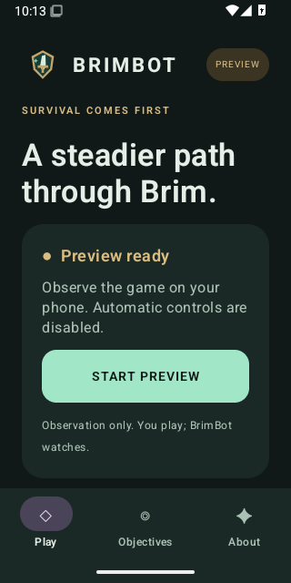

# BrimBot

Native Android research toward a screen-only visual player for **Blades of Brim**.

**Version 0.1.0-preview observes the screen; it does not play the game.** The
requested autonomous bot is unfinished. Game controls are disabled because
enemy, hazard, player and safe-path recognition are not qualified. See
[EVALUATION.md](EVALUATION.md) for measured results and missing gameplay evidence.
No game assets, modified game APKs, memory access, or hooks are used.

## Preview APK

[Release and APK](https://github.com/flaster101/BrimBot/releases/tag/v0.1.0-preview)
· Android 8.0 or later · universal APK · local inference · no internet permission

Install `BrimBot.apk`, complete onboarding and use **START PREVIEW**. Android asks
for the game-window/accessibility setting, notifications and screen sharing.
Blades of Brim must be installed separately. You play the game yourself; this
release only observes. Stop from BrimBot or its notification. No training,
model selection, coordinate setup or external Python service is required.

## What has been verified

- 45 Python tests and 12 Kotlin/JVM tests pass.
- Four Android 15 emulator tests pass: app navigation/permission cancellation,
  missing-consent rejection, real capture consent/rotation/notification Stop,
  and Python-to-Android model output parity within 0.0001 absolute error.
- Two surface models were actually trained and compared. The packaged custom
  CNN is 38,980 bytes, trained on 30 pseudo-labeled frames with 19 validation
  frames. Its 93.93% pseudo IoU measures teacher agreement, not safe navigation.
- Six screen geometries and both tensor layouts have numerical transform tests.
- Separate-source replay: 21,096 decoded / 7,032 analyzed frames over about
  704 seconds. All actions withheld; no autonomous survival claim.

There is no demonstrated autonomous survival, enemy-detection accuracy or
physical-phone performance. See [delivery status](docs/STATUS.md) and the
[model card](MODEL_CARD.md) before interpreting the preview.

## Product

One start button, permission guidance, on-device screen analysis, and a persistent
stop control. The application must withhold gestures when the game is not active,
the screen mapping is uncertain, or the installed perception package has not
passed the release gate. No model or coordinate configuration belongs in the
normal user interface.

## Repository

| Directory | Responsibility |
| --- | --- |
| `android/` | Kotlin app, capture, gestures, Material interface |
| `perception/` | Model contracts, transforms, tracking and baseline analysis |
| `dataset_tools/` | Provenance, temporal splits, diverse sampling and label QC |
| `training/` | Reproducible training and candidate comparison |
| `evaluation/` | Replay, metrics and release qualification |
| `models/` | Model manifest and validation status |
| `tests/` | Offline regression tests |
| `docs/` | Research and implementation records |

## Engineering documentation

[Game knowledge](GAME_KNOWLEDGE.md) · [Architecture](ARCHITECTURE.md) ·
[Dataset](DATASET.md) · [Training](TRAINING.md) · [Evaluation](EVALUATION.md) ·
[Android](ANDROID.md) · [Model card](MODEL_CARD.md)

BrimBot is an independent project and is not affiliated with SYBO.
